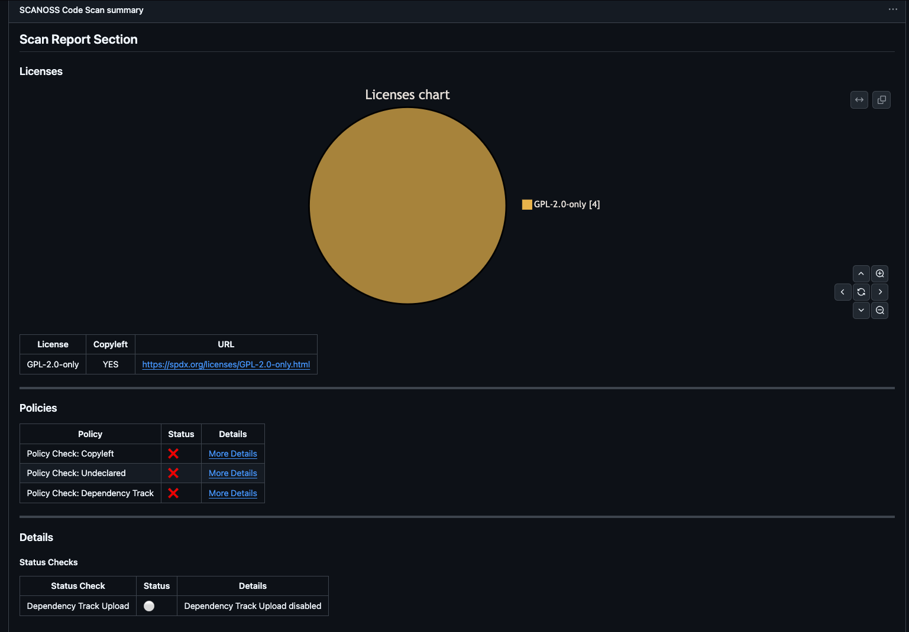
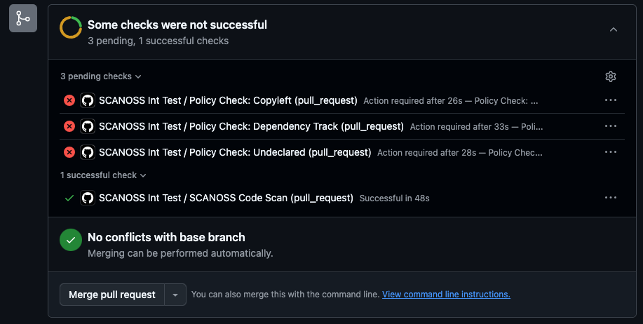
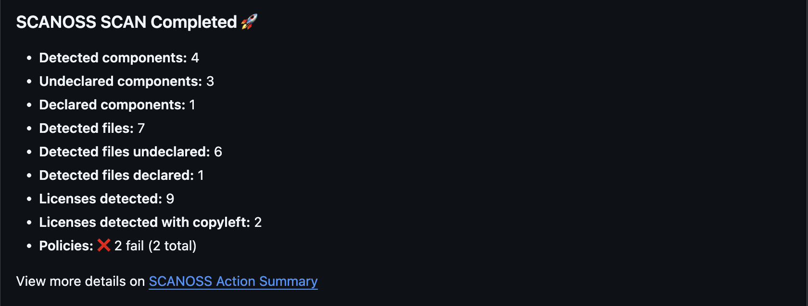

# SCANOSS Code Scan Action

[](https://github.com/super-linter/super-linter)

[](https://github.com/scanoss/scanoss-code-scan-step/actions/workflows/check-dist.yml)
[](https://github.com/scanoss/scanoss-code-scan-step/actions/workflows/codeql-analysis.yml)


The SCANOSS Code Scan Action enhances your software development process by automatically scanning your code for security
vulnerabilities and license compliance with configurable policies.

<div style="text-align: center">
  
  

</div>

## Breaking change v1.0.1

- Default runtime container updated to `ghcr.io/scanoss/scanoss-py:v1.19.0`
- Removed parameters:
   - `sbom.enabled`
   - `sbom.filepath`
   - `sbom.type`

### Converting from sbom.json to scanoss.json
The SBOM configuration format has changed and the file name must be updated from **sbom.json** to **scanoss.json**. Here's how to convert your existing configuration:

Old format (sbom.json):
```json
{
  "components": [
    {
      "purl": "pkg:github/scanoss/scanner.c"
    }
  ]
}
```

New format (scanoss.json):
```json
{
  "bom": {
    "include": [
      {
        "purl": "pkg:github/scanoss/scanner.c"
      }
    ]
  }
}
```


## Usage

To begin using this action, you'll need to set up a basic GitHub workflow and define a job within it:

```yaml
name: Example Workflow with SCANOSS

on:
  pull_request:
  push:
    branches:
      - '*'

permissions:
  contents: read
  pull-requests: write
  checks: write
  actions: read

jobs:
  scanoss-code-scan:
    name: SCANOSS Code Scan 
    runs-on: ubuntu-latest

    steps:
      - name: Checkout code
        uses: actions/checkout@v4

      - name: Run SCANOSS Code Scan
        id: scanoss-code-scan-step
        uses: scanoss/code-scan-action@v1
```

For example workflow runs, check out our
[GitHub Action Usage Example](https://github.com/scanoss/integration-github-actions) :rocket:

### Action Input Parameters

| **Parameter**              | **Description**                                                                                                                                          | **Required** | **Default**                          | 
|----------------------------|----------------------------------------------------------------------------------------------------------------------------------------------------------|--------------|--------------------------------------|
| output.filepath            | Scan output file name.                                                                                                                                   | Optional     | `scanoss-raw.json`                   |
| dependencies.enabled       | Option to enable or disable scanning of dependencies.                                                                                                    | Optional     | `false`                              |
| dependencies.scope         | Gets development or production dependencies (scopes: prod - dev)                                                                                         | Optional     | -                                    |
| dependencies.scope.include | Custom list of dependency scopes to be included. Provide scopes as a comma-separated list.                                                               | Optional     | -                                    |
| dependencies.scope.exclude | Custom list of dependency scopes to be excluded. Provide scopes as a comma-separated list.                                                               | Optional     | -                                    |
| policies                   | List of policies separated by commas, options available are: copyleft (cpl), undeclared (und), depTrack (dt).                                            | Optional     | -                                    |
| policies.halt_on_failure   | Halt check on policy failure. If set to false checks will not fail.                                                                                      | Optional     | `true`                               |
| api.url                    | SCANOSS API URL                                                                                                                                          | Optional     | `https://api.osskb.org/scan/direct`  |
| api.key                    | SCANOSS API Key                                                                                                                                          | Optional     | -                                    |
| licenses.copyleft.include  | List of Copyleft licenses to append to the default list. Provide licenses as a comma-separated list.                                                     | Optional     | -                                    |
| licenses.copyleft.exclude  | List of Copyleft licenses to remove from default list. Provide licenses as a comma-separated list.                                                       | Optional     | -                                    |
| licenses.copyleft.explicit | Explicit list of Copyleft licenses to consider. Provide licenses as a comma-separated list.                                                              | Optional     | -                                    |
| runtimeContainer           | Runtime URL                                                                                                                                              | Optional     | `ghcr.io/scanoss/scanoss-py:v1.46.0` |
| skipSnippets               | Skip the generation of snippets. (scanFiles option must be enabled)                                                                                      | Optional     | `false`                              |
| scanFiles                  | Enable or disable file and snippet scanning                                                                                                              | Optional     | `true`                               |
| scanossSettings            | Settings file to use for scanning. See the SCANOSS settings [documentation](https://scanoss.readthedocs.io/projects/scanoss-py/en/latest/#settings-file) | Optional     | `true`                               |
| settingsFilepath           | Filepath of the SCANOSS settings to be used for scanning                                                                                                 | Optional     | `scanoss.json`                       |
| scanMode                   | Choose between delta scan and full scan                                                                                                                  | Optional     | `full`                               |
| scanPath                   | Relative path within the repository to scan (e.g., `src` or `packages/api`)                                                                              | Optional     | `.`                                  |
| debug                      | Enable debugging                                                                                                                                         | Optional     | `false`                              |
| deptrack.upload            | Enable automatic upload of scan results to Dependency Track                                                                                              | Optional     | `false`                              |
| deptrack.url               | URL of the Dependency Track instance. Required when Dependency Track is enabled                                                                          | Required*    | -                                    |
| deptrack.apikey            | Dependency Track API key. Required when Dependency Track is enabled                                                                                      | Required*    | -                                    |
| deptrack.projectid         | UUID of an existing project in Dependency Track.<br/>Required when project name and version are not provided                                             | Required*    | -                                    |
| deptrack.projectname       | Dependency track project name identifier. (will be created if it doesn't exist). Required when project ID is not provided                                | Optional     | -                                    |
| deptrack.projectversion    | Dependency Track project Version identifier. Required when project ID is not provided                                                                    | Optional     | -                                    |

### Action Output Parameters

In addition to the automatically generated reports, the action also outputs the raw scan data, enabling you to integrate
the output into your custom workflow

| **Parameter**       | **Description**          |
|---------------------|--------------------------|
| result-filepath     | Scanner results filepath |  
| stdout-scan-command | Scanner command output   |

## Scan Tuning Parameters

The SCANOSS scan engine supports [scan tuning parameters](https://github.com/scanoss/scanoss.py/blob/main/docs/source/scanoss_settings_schema.rst#scan-tuning-parameters) for snippet matching.

> **Important:** Scan tuning parameters must be configured through the `scanoss.json`. They are **not** configured as GitHub Action input parameters.

## Policy Checks
The SCANOSS Code Scan Action includes three configurable policies:

1. **Copyleft** (`copyleft or cpl`): This policy checks if any component or code snippet is associated with a copyleft license. If such a
   license is detected, the pull request (PR) is rejected. The default list of Copyleft licenses is defined in the following [file](https://github.com/scanoss/gha-code-scan/blob/main/src/utils/license.utils.ts).

2. **Undeclared** (`undeclared or und`): This policy compares the components detected in the repository against those declared in scanoss.json
   file (customizable through the settingsFilepath parameter). If there are undeclared components, the PR is rejected.

3. **Dependency Track** (`depTrack or dt`): This policy integrates with [Dependency Track](https://dependencytrack.org/) to check for security vulnerabilities, license violations, and policy compliance. It requires Dependency Track configuration parameters to be set.

In this scenario, a classic policy is executed that will fail if copyleft licenses are found within the results:



Additionally, if it is a Pull Request, a comment with a summary of the report will be automatically generated.



## Dependency Track Integration

The SCANOSS Code Scan Action provides comprehensive integration with [Dependency Track](https://dependencytrack.org/) for advanced vulnerability management and policy compliance:

### Features

- **Automatic SBOM Upload**: Converts scan results to CycloneDX format and uploads to your Dependency Track instance
- **Upload Status Monitoring**: Creates a dedicated GitHub check to monitor upload success/failure with detailed diagnostics
- **Policy Violation Scanning**: Checks your Dependency Track instance for security vulnerabilities, license violations, and policy compliance
- **Project Management**: Automatically creates projects in Dependency Track or works with existing projects

### GitHub Checks Created

When Dependency Track integration is enabled, you'll see these checks in your GitHub Actions:

1. **Status Check: Dependency Track Upload** - Shows upload status and diagnostics
2. **Policy Check: Dependency Track** - Shows policy violations and security findings (if `dt` policy is enabled)
3. **Policy Check: Copyleft** - License compliance (if `copyleft` policy is enabled)  
4. **Policy Check: Undeclared** - Component declaration compliance (if `undeclared` policy is enabled)

### Configuration

#### Basic Configuration
```yaml
- name: Run SCANOSS Code Scan with Dependency Track
  uses: scanoss/code-scan-action@v1
  with:
    deptrack.upload: true
    deptrack.url: 'https://your-dt-instance.com'
    deptrack.apikey: ${{ secrets.DT_API_KEY }}
    deptrack.projectname: 'my-project'
    deptrack.projectversion: '1.0.0'
```

#### Advanced Configuration with Policies
```yaml
- name: Run SCANOSS Code Scan with Full Dependency Track Integration
  uses: scanoss/code-scan-action@v1
  with:
    policies: copyleft, undeclared, dt  # Enable all policies including Dependency Track
    deptrack.upload: true
    deptrack.url: 'https://your-dt-instance.com'
    deptrack.apikey: ${{ secrets.DT_API_KEY }}
    deptrack.projectid: 'existing-project-uuid'  # Use existing project
    policies.halt_on_failure: false  # Don't fail build on policy violations
```

### Troubleshooting

**Upload Status Check**: Click on the "Status Check: Dependency Track Upload" to see detailed diagnostics including:
- Upload success/failure status
- Project information and links
- File size and component count
- Detailed error messages with troubleshooting steps

**Common Issues**:
- **Authentication**: Verify your API key has proper permissions
- **Network**: Ensure GitHub Actions can reach your Dependency Track instance
- **Project Configuration**: Check that project name/version or project ID is correct

## Full example

```yaml
name: Full Example Workflow with SCANOSS

on:
  pull_request:
  push:
    branches:
      - '*'

permissions:
  contents: read
  pull-requests: write
  checks: write
  actions: read

jobs:
   scanoss-code-scan:
    name: SCANOSS Code Scan
    runs-on: ubuntu-latest

    steps:
      - name: Checkout code
        uses: actions/checkout@v4

      - name: Run SCANOSS Code Scan
        id: scanoss-code-scan-step
        uses: scanoss/code-scan-action@v1
        with:
          policies: copyleft, undeclared, dt
          scanMode: 'delta'
          dependencies.enabled: true
          deptrack.upload: true
          deptrack.url: 'https://your-dt-instance.com'
          deptrack.apikey: ${{ secrets.DT_API_KEY }}
          deptrack.projectname: 'my-project'
          deptrack.projectversion: '1.0.0'
          # api.url: <YOUR_API_URL>
          # api.key: <YOUR_API_KEY>
          
      - name: Print stdout scan command
        run: echo "${{ steps.scanoss-code-scan-step.outputs.stdout-scan-command }}"

      - name: Print Results
        run: cat "${{ steps.scanoss-code-scan-step.outputs.result-filepath }}"
```